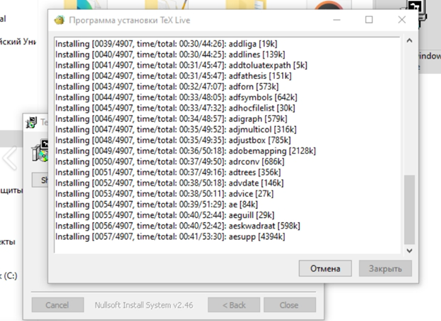
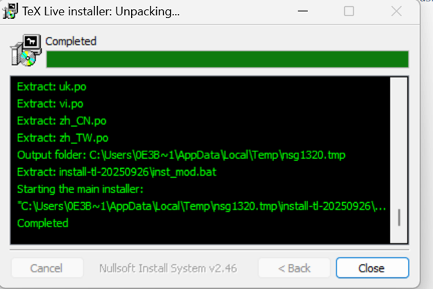

---
# Front matter
lang: ru-RU
title: "Лабораторная работа №1"
subtitle: "Практикум по научному письму"
author: "Роман Сергей Михайлович"

## Generic otions
toc-title: "Содержание"

## Bibliography
bibliography: cite.bib
csl: pandoc/csl/gost-r-7-0-5-2008-numeric.csl

## Pdf output format
fontsize: 12pt
linestretch: 1.5
papersize: a4
documentclass: scrreprt
## I18n polyglossia
polyglossia-lang:
  name: russian
  options:
    - spelling=modern
    - babelshorthands=true
polyglossia-otherlangs:
  name: english
## I18n babel
babel-lang: russian
babel-otherlangs: english
## Fonts
mainfont: IBM Plex Serif
romanfont: IBM Plex Serif
sansfont: IBM Plex Sans
monofont: IBM Plex Mono
mathfont: STIX Two Math
mainfontoptions: Ligatures=Common,Ligatures=TeX,Scale=0.94
romanfontoptions: Ligatures=Common,Ligatures=TeX,Scale=0.94
sansfontoptions: Ligatures=Common,Ligatures=TeX,Scale=MatchLowercase,Scale=0.94
monofontoptions: Scale=MatchLowercase,Scale=0.94,FakeStretch=0.9
mathfontoptions:
## Biblatex
biblatex: true
biblio-style: "gost-numeric"
biblatexoptions:
  - parentracker=true
  - backend=biber
  - hyperref=auto
  - language=auto
  - autolang=other*
  - citestyle=gost-numeric
## Pandoc-crossref LaTeX customization
figureTitle: "Рис."
listingTitle: "Листинг"
lofTitle: "Список иллюстраций"
lolTitle: "Листинги"
toc: true
lof: true
## Misc options
indent: true
header-includes:
  - \usepackage{indentfirst}
  - \usepackage{float} # keep figures where there are in the text
  - \floatplacement{figure}{H} # keep figures where there are in the text
  - \usepackage{hyperref}
  - \newcommand{\figrefp}[1]{\hyperref[#1]{(рис.~\ref*{#1})}}
---

# Цель работы

Выполнить установку программы, познакомиться с языком LaTeX.
# Задание

1. Установить LaTeX

# Выполнение лабораторной работы

 
Устанавливаем программу на windows. Для того чтобы установить программу, нам необходимо скачать файл exe для установки. Для разных операционных систем есть разные способы установки программ. Нам необходимо дождаться полной загрузки системы. \figrefp{fig:001} 

{ #fig:001 width=70% }

 
Далее во втором окне завершаем установку программы. \figrefp{fig:002} 

{ #fig:002 width=70% }

Программа установлена и на работает на компьютере. Используя TeXworks мы можем работать с документами. Установка завершена. \figrefp{fig:003} 

{ #fig:003 width=70% }

# Выводы

Познакомился с языком LaTeX, выполнил установку программы. 

# Список литературы

Лабораторная работа №1
Практикум по научному письму [Электронный ресурс]. URL: https://esystem.rudn.ru/pluginfile.php/2862317/mod_folder/content/0/Practical-scientific-writing.pdf

