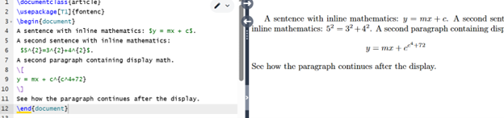
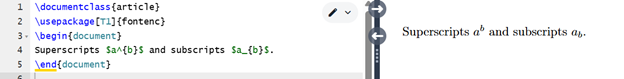
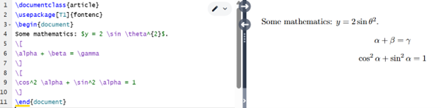
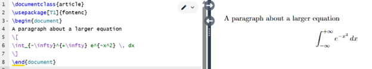
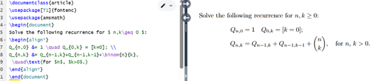
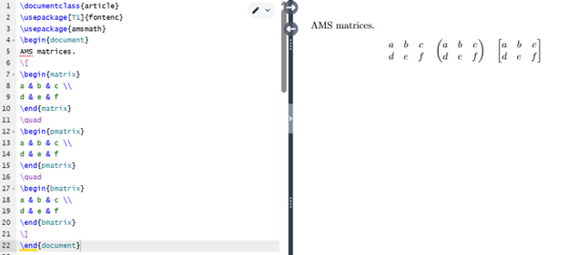
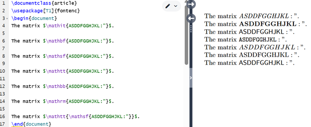
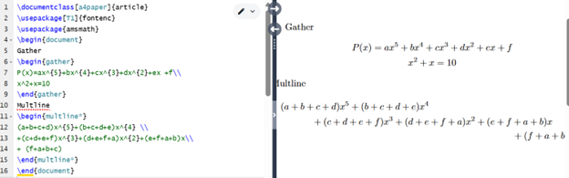
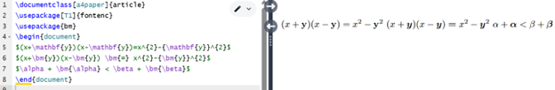

---
# Front matter
lang: ru-RU
title: "Лабораторная работа №3"
subtitle: "Практикум по научному письму"
author: "Роман Сергей Михайлович"

## Generic otions
lang: ru-RU
toc-title: "Содержание"

## Bibliography
bibliography: cite.bib
csl: pandoc/csl/gost-r-7-0-5-2008-numeric.csl

## Pdf output format
fontsize: 12pt
linestretch: 1.5
papersize: a4
documentclass: scrreprt
## I18n polyglossia
polyglossia-lang:
  name: russian
  options:
	- spelling=modern
	- babelshorthands=true
polyglossia-otherlangs:
  name: english
## I18n babel
babel-lang: russian
babel-otherlangs: english
## Fonts
mainfont: IBM Plex Serif
romanfont: IBM Plex Serif
sansfont: IBM Plex Sans
monofont: IBM Plex Mono
mathfont: STIX Two Math
mainfontoptions: Ligatures=Common,Ligatures=TeX,Scale=0.94
romanfontoptions: Ligatures=Common,Ligatures=TeX,Scale=0.94
sansfontoptions: Ligatures=Common,Ligatures=TeX,Scale=MatchLowercase,Scale=0.94
monofontoptions: Scale=MatchLowercase,Scale=0.94,FakeStretch=0.9
mathfontoptions:
## Biblatex
biblatex: true
biblio-style: "gost-numeric"
biblatexoptions:
  - parentracker=true
  - backend=biber
  - hyperref=auto
  - language=auto
  - autolang=other*
  - citestyle=gost-numeric
## Pandoc-crossref LaTeX customization
figureTitle: "Рис."
listingTitle: "Листинг"
lofTitle: "Список иллюстраций"
lolTitle: "Листинги"
## Misc options
indent: true
header-includes:
  - \usepackage{indentfirst}
  - \usepackage{float} # keep figures where there are in the text
  - \floatplacement{figure}{H} # keep figures where there are in the text
---

# Цель работы

Узнать о математическом режиме LaTeX, о том, как вводить встроенные и отображаемые формулы, о расширениях, предоставляемых пакетом amsmath, и о том, как менять шрифты в математических формулах.

# Задание

1. Изучить новый режим
2. Изучить все необходимые формулы и расширения, предоставляемые пакетом amsmath

# Выполнение лабораторной работы

 
Для начала рассмотрим как написать математическую формулу. 

{ #fig:001 width=70% }

 
Мы можем легко добавлять надстрочные и подстрочные символы. Они обозначаются как ^ и _, соответственно. 

{ #fig:002 width=70% }

Существует множество специализированных команд для математического режима. 

{ #fig:003 width=70% }

Для отображения математических формул можно использовать те же команды, что и для встроенного математического режима.

{ #fig:004 width=70% }

Пакет amsmath расширяет базовую поддержку, позволяя реализовать гораздо больше идей.

{ #fig:005 width=70% }

В пакете также есть несколько других удобных сред, например для работы с матрицами. 

{ #fig:006 width=70% }

Теперь рассмотрим способы использования шрифтов. В отличие от обычного текста, изменение шрифта в математическом режиме часто имеет особое значение. Поэтому такие изменения часто указываются явно. Для этого используется набор необходимых команд:

{ #fig:007 width=70% }

Помимо окружения align*, показанного в основном уроке, в пакете amsmath есть несколько других конструкций для отображения математических формул, в частности gather для многострочных отображений, не требующих выравнивания. 

{ #fig:008 width=70% }

В стандартном LaTeX есть два способа выделить жирным шрифтом математические символы. Чтобы выделить жирным шрифтом всё выражение, используйте \boldmath перед вводом выражения. Также доступна команда \\mathbf для выделения отдельных букв или слов прямым жирным шрифтом. 

{ #fig:009 width=70% }

На этом лабораторная работа закончена. 

# Выводы

1. Изучил новый режим
2. Изучил все необходимые формулы и расширения, предоставляемые пакетом amsmath

# Список литературы

Лабораторная работа №3
Практикум по научному письму [Электронный ресурс]. URL: https://esystem.rudn.ru/pluginfile.php/2862317/mod_folder/content/0/Practical-scientific-writing.pdf

