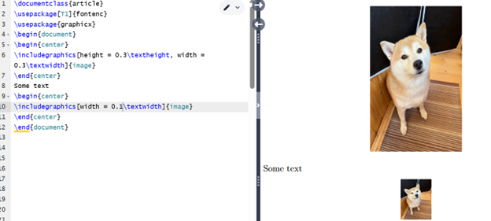
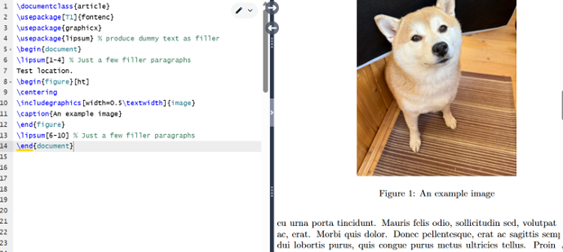
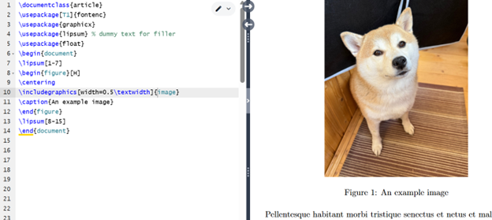

---
## Front matter
lang: ru-RU
title: Практикум по научному письму
author: Роман Сергей Михайлович
institute: РУДН, Москва, Россия

date: 15 Октября 2025

## Formatting
## i18n babel
babel-lang: russian
babel-otherlangs: english

## Formatting pdf
toc: false
toc-title: Содержание
slide_level: 2
aspectratio: 169
section-titles: true
theme: metropolis
header-includes:
 - \metroset{progressbar=frametitle,sectionpage=progressbar,numbering=fraction}

---

# Лабораторная работа 4

## Изображения в LaTeX

{ #fig:001 width=70% }

## Размер изображения 1

{ #fig:002 width=70% }

## Размер изображения 2

{ #fig:003 width=70% }

## Изображения в документе

{ #fig:004 width=70% }

## images float

{ #fig:005 width=70% }

## images float

{ #fig:006 width=70% }

## Ссылка

{ #fig:007 width=70% }

## Гиперссылка

{ #fig:008 width=70% }

## Выводы

1. Добавил графику из внешнего источника в LaTeX. 
2. Освоил новый графический пакет.
3. Научился оформлять изображения в LaTeX.

## {.standout}

Спасибо за внимание!
