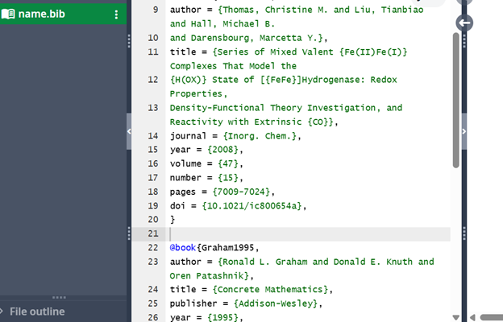
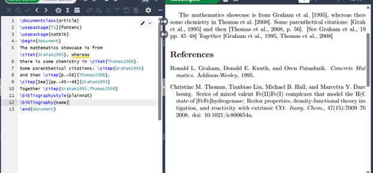
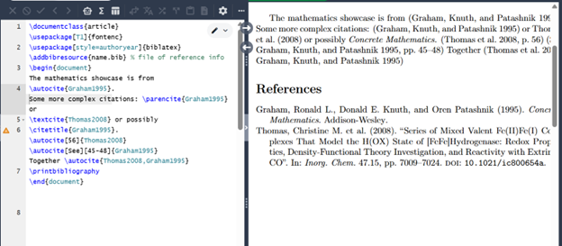

---
## Front matter
lang: ru-RU
title: Практикум по научному письму
author: Роман Сергей Михайлович
institute: РУДН, Москва, Россия

date: 8 Ноября 2025

## Formatting
## i18n babel
babel-lang: russian
babel-otherlangs: english

## Formatting pdf
toc: false
toc-title: Содержание
slide_level: 2
aspectratio: 169
section-titles: true
theme: metropolis
header-includes:
 - \metroset{progressbar=frametitle,sectionpage=progressbar,numbering=fraction}

---

# Лабораторная работа 6

## Работа с bib

{ #fig:001 width=70% }

## BibTeX

{ #fig:002 width=70% }

## biblatex

{ #fig:003 width=70% }

## Выводы

- Познакомился с LaTeX
- Изучил новый пакет
- Научился работе с библиографией

## {.standout}

Спасибо за внимание!
