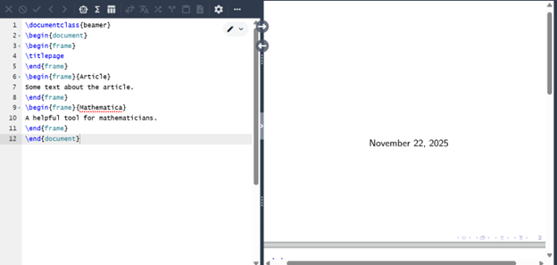
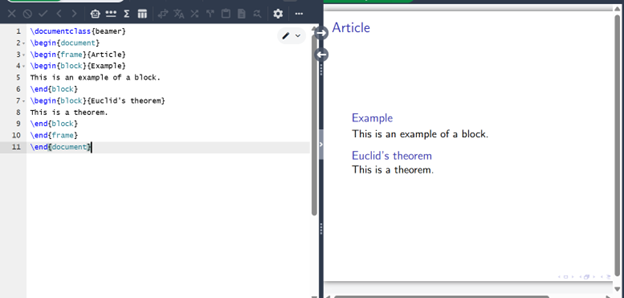
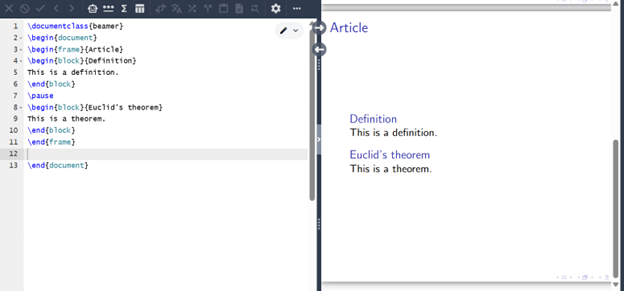
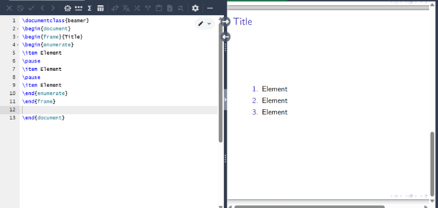
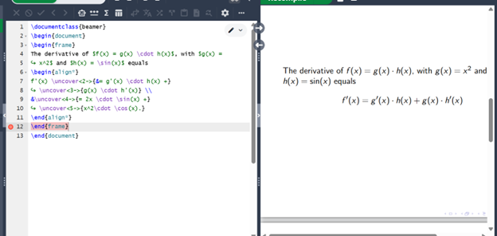
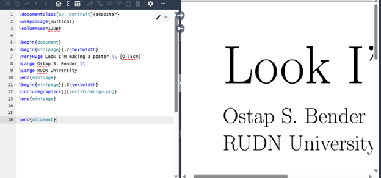

---
# Front matter
lang: ru-RU
title: "Лабораторная работа №7"
subtitle: "Практикум по научному письму"
author: "Роман Сергей Михайлович"

## Generic otions
toc-title: "Содержание"

## Bibliography
bibliography: cite.bib
csl: pandoc/csl/gost-r-7-0-5-2008-numeric.csl

## Pdf output format
fontsize: 12pt
linestretch: 1.5
papersize: a4
documentclass: scrreprt
## I18n polyglossia
polyglossia-lang:
  name: russian
  options:
    - spelling=modern
    - babelshorthands=true
polyglossia-otherlangs:
  name: english
## I18n babel
babel-lang: russian
babel-otherlangs: english
## Fonts
mainfont: IBM Plex Serif
romanfont: IBM Plex Serif
sansfont: IBM Plex Sans
monofont: IBM Plex Mono
mathfont: STIX Two Math
mainfontoptions: Ligatures=Common,Ligatures=TeX,Scale=0.94
romanfontoptions: Ligatures=Common,Ligatures=TeX,Scale=0.94
sansfontoptions: Ligatures=Common,Ligatures=TeX,Scale=MatchLowercase,Scale=0.94
monofontoptions: Scale=MatchLowercase,Scale=0.94,FakeStretch=0.9
mathfontoptions:
## Biblatex
biblatex: true
biblio-style: "gost-numeric"
biblatexoptions:
  - parentracker=true
  - backend=biber
  - hyperref=auto
  - language=auto
  - autolang=other*
  - citestyle=gost-numeric
## Pandoc-crossref LaTeX customization
figureTitle: "Рис."
listingTitle: "Листинг"
lofTitle: "Список иллюстраций"
lolTitle: "Листинги"
toc: true
lof: true
## Misc options
indent: true
header-includes:
  - \usepackage{indentfirst}
  - \usepackage{float} # keep figures where there are in the text
  - \floatplacement{figure}{H} # keep figures where there are in the text
  - \usepackage{hyperref}
  - \newcommand{\figrefp}[1]{\hyperref[#1]{(рис.~\ref*{#1})}}
---

# Цель работы

Познакомиться с языком LaTeX, продолжить изучение его возможностей. 

# Задание

1. Запустить несколько различных программ, изучить новый пакет для работы с презентациями и новые команды языка.

# Выполнение лабораторной работы

 
В LaTeX можно создавать презентации с помощью класса документа beamer. Чтобы создать слайды, можно использовать среду frame с заголовком слайда в качестве единственного аргумента. \figrefp{fig:001} 

{ #fig:001 width=70% }
 
Упорядочим информацию в презентации. \figrefp{fig:002} 

{ #fig:002 width=70% }

Чтобы элементы слайда появлялись один за другим, используем pause.  \figrefp{fig:003} 

{ #fig:003 width=70% }

Мы так же можем использовать это в перечислении \figrefp{fig:004} 

{ #fig:004 width=70% }

С помощью команды uncover можно точно определить, когда будет отображаться каждая часть слайда. Эта команда более гибкая, чем команда pause. Ниже приведен пример использования команды uncover \figrefp{fig:005}

{ #fig:005 width=70% }

Продемонстрируем один из способов переноса общей структуры плаката в LaTeX. \figrefp{fig:006} 

{ #fig:006 width=70% }

Программы работают верно. 

# Выводы

Познакомился с языком LaTeX, продолжил изучение его возможностей.

# Список литературы

Лабораторная работа №7
Практикум по научному письму [Электронный ресурс]. URL: https://esystem.rudn.ru/pluginfile.php/2862317/mod_folder/content/0/Practical-scientific-writing.pdf

