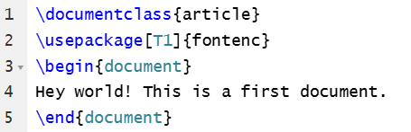
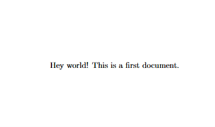
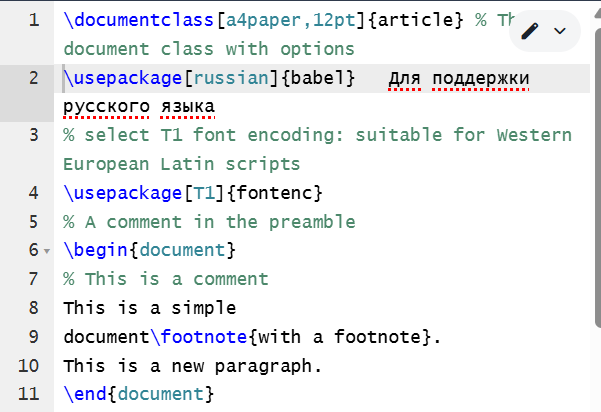
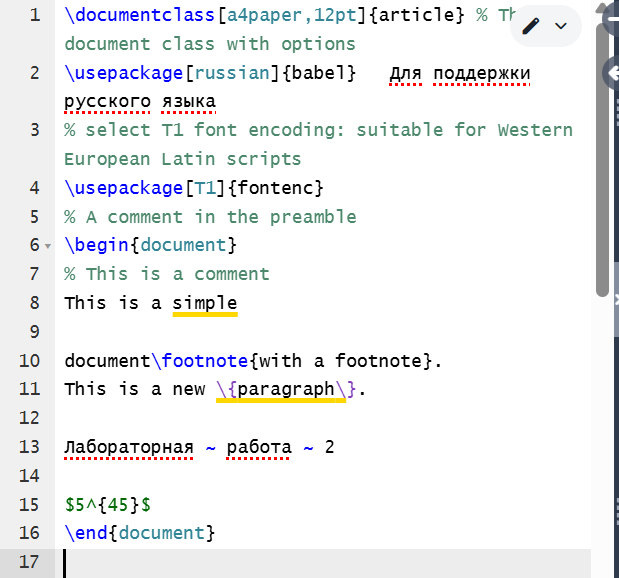
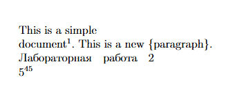

---
# Front matter
lang: ru-RU
title: "Лабораторная работа №2"
subtitle: "Практикум по научному письму"
author: "Роман Сергей Михайлович"

## Generic otions
lang: ru-RU
toc-title: "Содержание"

## Bibliography
bibliography: cite.bib
csl: pandoc/csl/gost-r-7-0-5-2008-numeric.csl

## Pdf output format
fontsize: 12pt
linestretch: 1.5
papersize: a4
documentclass: scrreprt
## I18n polyglossia
polyglossia-lang:
  name: russian
  options:
	- spelling=modern
	- babelshorthands=true
polyglossia-otherlangs:
  name: english
## I18n babel
babel-lang: russian
babel-otherlangs: english
## Fonts
mainfont: IBM Plex Serif
romanfont: IBM Plex Serif
sansfont: IBM Plex Sans
monofont: IBM Plex Mono
mathfont: STIX Two Math
mainfontoptions: Ligatures=Common,Ligatures=TeX,Scale=0.94
romanfontoptions: Ligatures=Common,Ligatures=TeX,Scale=0.94
sansfontoptions: Ligatures=Common,Ligatures=TeX,Scale=MatchLowercase,Scale=0.94
monofontoptions: Scale=MatchLowercase,Scale=0.94,FakeStretch=0.9
mathfontoptions:
## Biblatex
biblatex: true
biblio-style: "gost-numeric"
biblatexoptions:
  - parentracker=true
  - backend=biber
  - hyperref=auto
  - language=auto
  - autolang=other*
  - citestyle=gost-numeric
## Pandoc-crossref LaTeX customization
figureTitle: "Рис."
listingTitle: "Листинг"
lofTitle: "Список иллюстраций"
lolTitle: "Листинги"
## Misc options
indent: true
header-includes:
  - \usepackage{indentfirst}
  - \usepackage{float} # keep figures where there are in the text
  - \floatplacement{figure}{H} # keep figures where there are in the text
---

# Цель работы

Познакомиться с языком LaTeX.

# Задание

1. Реализовать основные команды

# Выполнение лабораторной работы

 
Согласно лабораторной работе, создадим первый документ. Для этого повторим код из лабораторной (рис. [-@fig:001] ) 

{ #fig:001 width=70% }

В данной программе мы создали текстовый документ pdf

Далее представлен результат работы программы (рис. [-@fig:002] ) 

{ #fig:002 width=70% }

Как видно, программа работает верно.

Напишем второй пример из лабораторной работы (рис. [-@fig:003] )  

{ #fig:003 width=70% }

Усложним код, чтобы посмотреть на работу программы. (рис. [-@fig:004] ) 

{ #fig:004 width=70% }

Знак процента преобразует всю следующую строку в комментарий, пустая строка переносит текст на следующую строку, а символ ~ обеспечивает большой пробел. Посмотрели как написать кавычки в виде текста и посмотрели некоторые функции LaTeX. (рис. [-@fig:005] ) 

{ #fig:005 width=70% }

Программа работает верно. 

# Выводы

Познакомился с языком LaTeX.

# Список литературы

Лабораторная работа №2
Практикум по научному письму [Электронный ресурс]. URL: https://esystem.rudn.ru/pluginfile.php/2862317/mod_folder/content/0/Practical-scientific-writing.pdf

